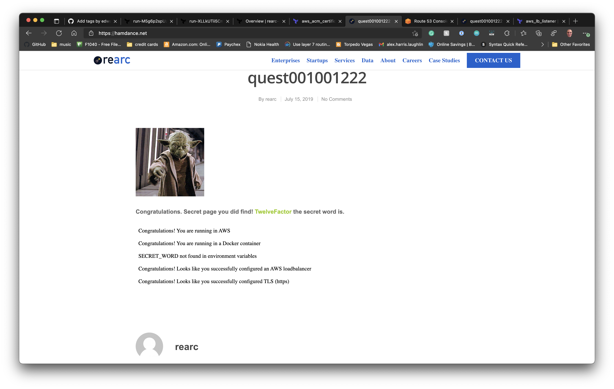

# rearc-quest-infra

[](https://wakatime.com/badge/github/edwardtheharris/rearc-quest-infra)

Terraform and other related code required to deploy the rearc quest app.

## Rearc Quest app

This code is meant to deploy and run the [rearc quest](https://github.com/rearc/quest) web app.

### tl;dr

You can find the app deployed in two locations having been deployed using two orchestrators.
Firstly, you can see the service running on ECS at [hamdance.net](http://hamdance.net).
Secondly, you can see the service running on EKS at [hamdance.com](http://hamdance.com).
Finally, please note that while the links in this readme use the `HTTP` protocol,
both sites redirect to `HTTPS` becase we are not beasts and this is a civilization.

## Usage

If you're starting from a fresh AWS account first thing is to install the AWS CLI. That is, after you've cloned this repository.

```bash
git clone https://github.com/edwardtheharris/rearc-quest-infra
cd rearc-quest-infra
```

### AWS CLI

This can be done cleanly with pipenv. Assuming you don't have pipenv but do have a Python 3 version with pip installed. . .

```bash
pip3 install pipenv
pipenv shell 
pipenv install
```

### First TF run

There's no getting around the need to download the root user's access key id and secret key, so do that and use the AWS CLI to configure a profile named `root` . You will also need to generate a gpg key to prevent the created user's access key id and secret key being written in plaintext everywhere Terraform cares to write it. Make sure to select RSA as the key type when you generate the key.

```bash
export gpg_key_user=somegpgreference

aws configure --profile root
gpg --full-generate-key
gpg --export ${gpg_key_user} | base64 > ${gpg_key_user}.gpg
```

Next configure the AWS profile to the root user, initialize the repository and apply the changes.

```bash
export TF_VAR_aws_profile=root

terraform init
terraform plan
terraform apply -target aws_iam_access_key.admin
```

Now we've got a key id and secret key. We can decode the secret key with gpg then use it to configure the default aws profile. Finally, we unset the environment variable that tells terraform to use the root user instead of our IAM user.

```bash
terraform output -raw secret_access_key | base64 -D > /tmp/secret.gpg
gpg -d /tmp/secret.gpg
aws configure
unset TF_VAR_aws_profile
```

## Deploy an ec2 instance

The instance described in `ec2.tf` ought to do.

```bash
terraform apply -target aws_instance.rearc
```

When that's finished (don't forget to give the user data some time to run as well) you can log in to the AWS console to find the public IP, then hit the deployed in your brower at port 3000.

## Build a Docker image

First make a repository to store it in.

### ECR

ECR works well for this.

```bash
terraform apply -target aws_ecr_repository.rearc-quest
```

When this apply is done, you can log in to the AWS console to retrieve the ECR login command. You need to run this to push the application image to ECR. By now you'll have the secret word, which is [very clever](https://12factor.net/).

```bash
aws ecr get-login-password --region us-west-2 | docker login --username AWS --password-stdin 629354604262.dkr.ecr.us-west-2.amazonaws.com
```

### Docker build

Run the image build command. And push the image.

```bash
docker build -t 629354604262.dkr.ecr.us-west-2.amazonaws.com/rearc/quest -f docker/Dockerfile docker/
docker push 629354604262.dkr.ecr.us-west-2.amazonaws.com/rearc/quest
```

Next, deploy an ECS cluster with one node per AZ. We'll do the same with EKS in a bit. . . or maybe not.

### ECS Cluster

Name the cluster `default` because this saves a lot of hassle with the ECS node user data settings.

```bash
terraform apply -target aws_ecs_service.rearc
```

That will deploy the ECS cluster and the required service and task configuration thanks to dependency chains.

### ALB

Now we should deploy the ALB so that traffic is balanced correctly.

```bash
terraform apply -target aws_lb.rearc
```

Should do it, if it doesn't, you should apply the remaining `aws_lb*` resources in the `ec2.tf` file.

### Route 53

Next, we should set up the DNS. For this you'll have to log into the AWS console and register a domain
from the route53 service. You could register a second domain if you plan to also deploy to EKS.

Once the domain(s) is(are) registered, we can deploy the route53 resources.

```bash
terraform apply -target aws_route53_record.hamdance
```

This will create the hosted zone and a DNS record to allow for accessing the service that is backed by an ECS cluster.

Next we add and validate certs.

```bash
terraform apply -target aws_acm_certificate.hamdance
```

Once this is done you can log in to the AWS console and navigate
to the ACM service to find the newly created cert and its related
validation requirements.

Next, update `r53.tf` so that `aws_route53_record.hamdance-validation`
matches the name and value listed on the ACM page.

When that's done, you can deploy the validation records.

```bash
terraform apply -target aws_route53_record.hamdance-validation
```

This should be success and it looks like this:



### EKS Cluster

Now for the really fun part.

First thing is to deploy the EKS cluster and it's related node groups.

```bash
terraform apply -target aws_eks_cluster.default
```

This will take around 15 or 20 minutes, once it's done
you need to update your local kubeconfig (`brew install kubernetes-cli` if you happen to not have kubectl handy)
with the handy tool that AWS CLI provides for this purpose.

```bash
aws eks update-kubeconfig --name default
```

You will need to switch the context if this isn't your first
kubeconfig update.

```bash
kubectl config get-contexts
kubectl config use-context $yourcontext
```

Try to fetch some objects from the EKS cluster to be sure it's working.

```bash
kubectl get all
```

That should show you a mostly empty default namespace.

### EKS services

Finally, the prestige. . .

We have an empty (and useless) EKS cluster now, so let's make it
do something useful.

#### IAM Updates

To make this work, we need to make some changes to the IAM
policies and roles available. This means applying all of the
resources in `iam.tf` that are below the `# EKS` comment.

```bash
terraform apply -target aws_iam_role.eks
terraform apply -target aws_iam_role.eksNodeRole
```

Should at least create the basics, you will also want to make sure
that all of the required policies and attachments
have been created before moving on or you will
see authentication errors
in the load balancer controller logs.

#### AWS Load Balancer Controller

Because we're using EKS we don't have to create or maintain
the load balancers our service will use, we can create and
maintain EKS services to do that for us.

This is done with the
[AWS Load Balancer Controller](https://kubernetes-sigs.github.io/aws-load-balancer-controller/v2.1/). The source files for which are included in the `k8s/` folder of this directory.

This relies on a service called Cert Manager, so this is the
the first thing we will deploy to our cluster.

```bash
kubectl apply -f k8s/cert-manager.yml
```

Now it's safe to deploy the load balancer controller.

```bash
kubectl apply -f k8s/aws-load-balancer-controller.yml
```

WHen that's done, you can verify it's running by checking the
`kube-system` namespace.

```bash
kubectl -n kube-system get all
```

You should see a pod that looks like the aws
load balancer controller running.

#### And now for the service

Now we've got everything we need to deploy the rearc service.

```bash
kubectl apply -f k8s/rearc.yml
```

This should deploy the service and associated ingress
controllers and load balancers so that we can now revisit
the Route53 deployment instructions above, except this time
we need to deploy the reaources related to
`aws_route53_zone.hamdance-com`.

In the unlikely event that this readme has proven sufficient,
congratulations, you just deployed a very simple web service
in a pair of architectures almost complex enough to be worthy
of something like the obfuscated Perl contest.

Thanks for playing along.
